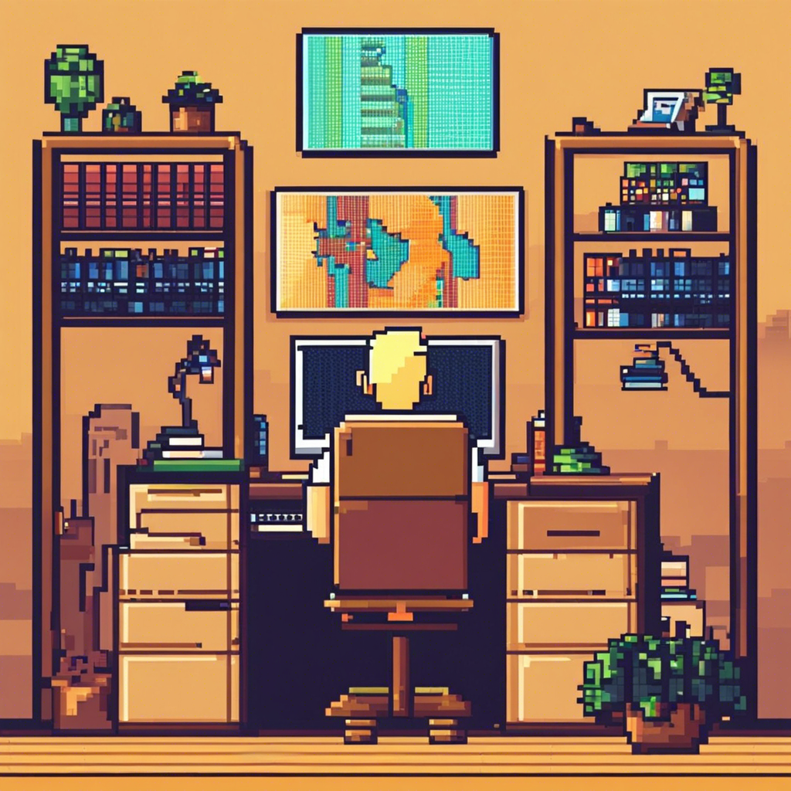

<h1 align="center">Hi 👋, I'm Rafael</h1>

- 🔭 I am currently working on developing my **hard skills**

- 🌱 I’m currently learning the **JavaScript stack**

- 👨‍💻 All of my projects are available at [https://github.com/rafinhaa](https://github.com/rafinhaa)

  
📝 About Me

  <h3 align="left">Formation</h3>
    
📚 Complete high school

    
🎓 University education

    
      
      <ul>        
        <ul>
          <li>
Graduated in systems analysis and development
</li>
          <li>
UNICSUL - Universidade Cruzeiro do Sul
</li>
          <li>
Completed in the second half of 2014
</li>
        </ul>
      </ul>
    

  <h3 align="left">Complementary Training</h3>
  
Several courses in the development area in the main schools in Brazil with a focus on Javascript, Typescript, ReactJS, React Native, NodeJS, Functional Programming and logic
  

<h3 align="left">Hey, contact me!</h3>

<h3 align="left">Development Skills</h3>
<h5 align="left">Languages</h5>

<h5 align="left">Markup Language</h5>

<h5 align="left">Database</h5>

<h5 align="left">Tools</h5>

<h5 align="left">Helpers</h5>

  
  

    

  

  

